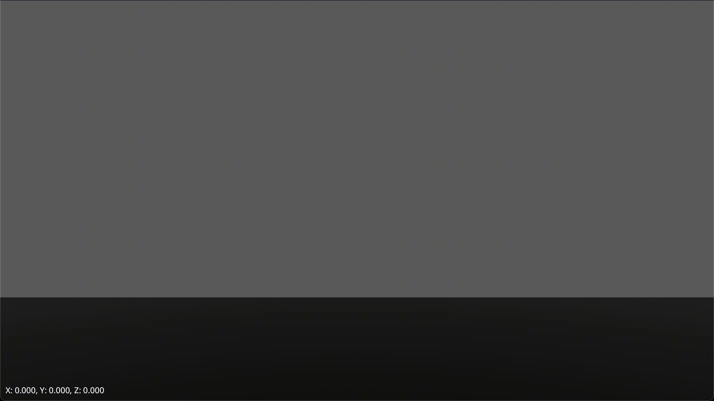

# `zenn-2022-05-15`

デモ:

- <https://bevy-zenn-2022-05-15.netlify.app>

記事:

- <https://zenn.dev/publictheta/articles/034a9e28073dfe>

## ライセンス

[assets/fonts/NotoSans-Regular.ttf](assets/fonts/NotoSans-Regular.ttf)は、Google Fontsから入手したもの（<https://fonts.google.com/noto/specimen/Noto+Sans/about>）を

- SIL Open Font License
    ([assets/fonts/OFL.txt](assets/fonts/OFL.txt))

にもとづいて再配布しているものです。著作権はGoogle LLCが保持しています。

それ以外のソースコードについてはリポジトリの`README.md`を参照してください。
